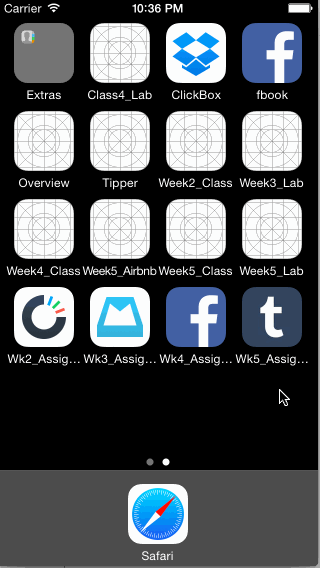

# Tumblr Demo
iOS Designers Bootcamp Week 5 Assignment

This is a working prototype of the Tumblr App.  
Time spent: 4 hours spent in total

**Tasks:** 
  * [x] Tapping on Home, Search, Account, or Trending should show the respective screen and highlight the tab bar button.
  * [x] Compose button should modally present the compose screen.
  * [x] Optional: Compose screen is faded in while the buttons animate in.
  * [x] Optional: Login button should show animate the login form over the view controller.
  * [ ] Optional: Discover bubble should bob up and down unless the SearchViewController is tapped.
  
Walkthrough of Tumblr:

GIF created with [LiceCap](http://www.cockos.com/licecap/).
